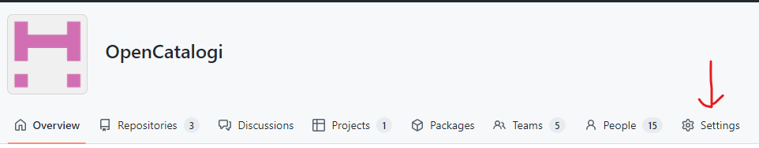
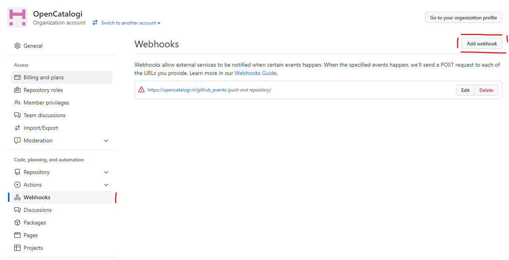

# Richtlijnen voor bijdragen

Als je een bijdrage wilt leveren aan deze repository, vragen we je om deze richtlijnen te volgen.

## Fouten melden
Als je een bug tegenkomt in dit onderdeel, controleer dan of er al een issue bestaat in onder de issue tab van deze repository.

Als een dergelijk probleem niet bestaat, kunt u er een [hier](/../../issues/new?assignees=&labels=&template=bug_report.md&title=) aanmaken.

Zorg ervoor dat u elke stap in detail beantwoordt.

## Nieuwe functies aanvragen
Controleer voordat u een nieuwe functie aanvraagt ​​of de functie niet wordt vermeld in de roadmap op het projectbord of op het tabblad Probleem in GitHub.

Als dit niet het geval is, kunt u er een [hier](/../../issues/new?assignees=&labels=&template=feature_request.md&title=) aanmaken.

Zorg ervoor dat u elke stap in detail beantwoordt.

## Forking van de repository
Om te beginnen moet je eerst de repository forken, wat kan [hier](/../../fork).
Zodra dit is gebeurd, kunt u het naar uw lokale computer klonen.

## De wijzigingen aanbrengen
Maak op uw lokale computer een nieuwe vertakking op de ontwikkelingsvertakking.
Gebruik de volgende naamgevingsconventie voor uw filiaalnaam:
- `issue/issue-nummer`
- `functie/functienaam`

Als je eenmaal wijzigingen of toevoegingen aan de code hebt gemaakt, kun je ze committen (probeer het commit-bericht beschrijvend maar kort te houden).
Zorg ervoor dat u uw commit-bericht opmaakt met het nummer van de uitgave.

## Codekwaliteit en conventies
Om de code schoon en leesbaar te houden, gebruiken we de volgende coderingsstandaarden:
- [Stijl-CI](https://styleci.io/)
- [Better code hub](https://bettercodehub.com/repositories)
- [PSR-02](https://docs.opnsense.org/development/guidelines/psr2.html)
- [Public Code](https://publiccode.net/)

### DocBlocks
We gebruiken [DocBlock](https://en.wikipedia.org/wiki/Docblock) annotaties in onze projecten.
Docblock-annotaties zijn een hulpmiddel om metadata in de documentatiesectie in te sluiten, die vervolgens door een of ander hulpmiddel kan worden verwerkt.

Een paar voorbeelden van hoe we dit toepassen in onze projecten:

```vue'
    /**
     * @var string Naam van deze applicatie
     *
     * @voorbeeld applicatienaam
     */
    privé $naam;


    /**
     * Functiebeschrijving komt hier.
     *
     * @param string $code de code ontvangen door id-vault oauth-eindpunt.
     * @param string $applicationId id van uw id-vault-toepassing.
     * @param string $geheim geheim van uw id-vault-toepassing.
     * @param string $state (optioneel) Een willekeurige string die door uw toepassing wordt gebruikt om een ​​unieke sessie te identificeren
     *
     * @return array|false informatie over wat deze functie retourneert
     */
    openbare functie authenticateUser(string $code, string $applicationId, string $secret, string $state = '')
    {

    }
```

Hier kun je meer over lezen:
- [DocBlock](https://en.wikipedia.org/wiki/Docblock)

### Postman
Om ervoor te zorgen dat uw wijzigingen werken, kunnen we dit testen met [Postman](https://www.postman.com/).
Zorg ervoor dat u een werkend Postman-testscript opgeeft in uw pull-verzoek.

### Testen en accepteren
Voor alle branches, wanneer een pull-verzoek wordt gestart
- Codebase controleert op kwetsbaarheden via [dependabot](https://github.com/dependabot)
- [Style CI](https://styleci.io/) wordt uitgevoerd om de kwaliteit van psr-02-compliance te bepalen
- [Better code hub](https://www.bettercodehub.com/) wordt uitgevoerd om de kwaliteit van de codebase te bepalen
- Containers worden gebouwd vanuit de codebase
- Containers worden gecontroleerd op kwetsbaarheden via [snyk](https://snyk.io/)

PR's kunnen alleen worden geaccepteerd als alle bovenstaande controles met succes zijn voltooid

Alleen voor ontwikkeling en acceptatie na PR-acceptatie
- Het (symantische) versienummer is verhoogd
- De changelog is gevuld met de vrijgegeven functies
- Containers worden gepubliceerd als artefact op github
- Na elke succesvolle container build wordt de container ingezet in de juiste omgeving. (dev voor ontwikkeling en Demodam voor acceptatie)
- Nadat de containers in de juiste omgeving zijn ingezet, wordt een Pen Test-tool (link invoegen) geactiveerd. De resultaten van de pentest worden naar de senior ontwikkelaar gemaild.
- Na elke implementatie worden de API's getest via de “api test voorziening”, de resultaten van deze testen zijn zichtbaar als een badge op de repositories readme.
- Na elke implementatie wordt de frontend gecontroleerd op WCAG-compliance
- Helmbestanden worden gepubliceerd op Artifacthub


## Bereid uw Pull Request voor

Bij het opstellen van je Pull Request moet je rekening houden met de volgende zaken:
- probeer de achterwaartse compatibiliteit niet te verbreken, PR's die de achterwaartse compatibiliteit verbreken, hebben minder kans om te worden samengevoegd;
- zorg ervoor dat u de coderingsnormen volgt die zijn gedefinieerd in het gedeelte over codekwaliteit
- schrijf duidelijke en beschrijvende commit-berichten

Als uw pull-verzoek een functieverzoek is, zorg er dan voor dat u het toevoegt aan de [changelog](CHANGELOG.md).

Geef in de beschrijving van het pull-verzoek zoveel mogelijk details over uw wijzigingen (schroom niet om codevoorbeelden te geven om uw punten te illustreren). Als uw pull-verzoek gaat over het toevoegen van een nieuwe functie of het wijzigen van een bestaande, leg dan de reden voor de wijzigingen uit. De beschrijving van het pull-verzoek helpt bij het beoordelen van de code en het dient als referentie wanneer de code wordt samengevoegd (de beschrijving van het pull-verzoek en alle bijbehorende opmerkingen maken deel uit van het commit-bericht voor samenvoegen).
Zorg ervoor dat je pull-verzoeken ook verwijzen naar ten minste een of meer van de problemen waaraan je hebt gewerkt.

Wanneer je denkt dat je code klaar is om te worden ingediend, kun je een pull-verzoek indienen bij de ontwikkelingstak.

Houd er rekening mee dat wanneer u een PR maakt, u het eigendom van uw code overdraagt.

Hoewel aan de bovenstaande vereisten moet zijn voldaan voordat uw pull-verzoek wordt beoordeeld, kunnen de beoordelaar(s) u vragen om extra ontwerpwerk, tests of andere wijzigingen uit te voeren voordat uw pull-verzoek uiteindelijk kan worden geaccepteerd.

## Componenten Publiceren
Voor het online plaatsen van componenten zijn twee routes
Via de codebase van het component zelf (de repository)
Via het zelf installeren en onderhouden van een open catalogi installatie

Aan de hand van zowel data bij de bron als goed gedocumenteerde (en daarmee zelf beschrijvende code) geniet het de voorkeur om code te publiceren vanuit repositories.

### Publiceren vanuit repositories

Publiceren vanuit repositories kan door het opnemen van een [publiccode.yaml](https://yml.publiccode.tools/schema.core.html#top-level-keys-and-sections) in de `root` (top folder) van de repository. Iedere open catalogi installatie waarop Github als bron is toegevoegd controleert ieder uur of er nieuwe componenten beschikbaar zijn. OpenCatalogi.nl controlleerd zelf in ieder geval ieder uur github.

Op de [website van public code](https://developers.italia.it/en/reuse) valt meer te lezen over de standaard en toepassing daarvan. Vanuit de italiaanse overheid is er tevens een [online editor](https://publiccode-editor.developers.italia.it/) beschikbaar voor het maken van public code bestanden.

Soms wil je geen uur wachten totdat een component (of wijzigingen daarbinnen) zichtbaar worden op github. In dat geval kan het wenselijk zijn om gebruik te maken van de opencatalogi github webhook (`https://opencatalogi.nl/github_events`). Deze github events kunnen zowel worden ingeregeld op repository als organisatieniveau. Vanuit open Catalogi zelf gaat de voorkeur uit naar organisatieniveau, in dat geval worden naast wijzigingen in de componenten ook wijzigingen in de organisatie beschrijven en het aanmaken van nieuwe repositories automatisch verwerkt. 

### Aanmaken van GitHub webhook
Kies op de organisaties pagina (of repository pagina voor de optie settings)

Kies vervolgens voor webhooks en druk rechts boven in op "Add webhook"

Geef vervolgens de volgende waardes op
- *Payload URL* https://opencatalogi.nl/github_events
- *Content type:* application/json
- *Secret* `leeg laten`
- *Which events would you like to trigger this webhook?* Let me select individual events. 
- En selecteer dan de events -> `Organizations`,`Repositories`,`Pull requests` en `Pushes`
- Controleer de active is aangevinkt en druk op `Add webhook`

Je webhook is nu aangemaakt

