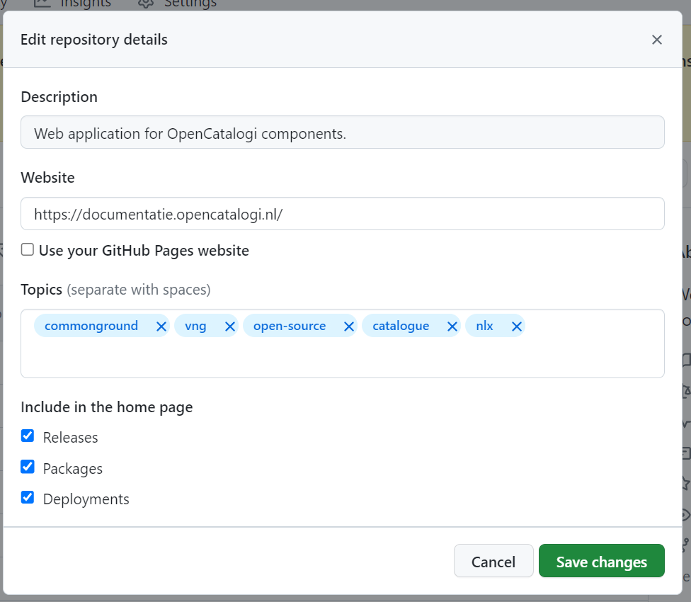

# Ratingssysteem voor OpenCatalogi

## Overzicht

Voor OpenCatalogi hanteren we een ratingssysteem gebaseerd op de kwaliteit van de documentatie. Een goed gedocumenteerd product ontvangt meer punten, wat bijdraagt aan een hogere rating. Dit systeem stimuleert ontwikkelaars om hun documentatie te verbeteren, waardoor de kwaliteit van OpenCatalogi als geheel toeneemt. Een hogere rating leidt tot een betere zichtbaarheid in OpenCatalogi, waardoor de kans groter is dat het product gebruikt wordt. Dit systeem moedigt ontwikkelaars aan om te investeren in de kwaliteit van hun documentatie.

## Rating Mechanisme

De rating wordt berekend op basis van een x/y schaal, waarbij:

- **x** staat voor het aantal verdiende punten.
- **y** staat voor het totaal aantal mogelijk te verdienen punten, afhankelijk van het type publicatie (bijvoorbeeld applicaties, componenten, configuraties en API's).

De verhouding tussen x en y resulteert in een percentage dat de score van de documentatie weergeeft. Dit percentage bepaalt de volgorde van weergave in de OpenCatalogi frontend en wordt getoond aan bezoekers.

## Beoordelingscriteria

De rating wordt vastgesteld door een repository te scannen op de aanwezigheid van specifieke documentatie, de inrichting van de repository zelf en de aanwezigheid van velden binnen de `publiccode.yaml`. 

| Aspect                         | Criteria                                                                | Max. Punten |
|--------------------------------| ----------------------------------------------------------------------- |-------------|
| **Aanwezigheid van bestanden** | Aanwezigheid, volledigheid en duidelijkheid.                            | 8           |
| **Inrichting van de repository** | Aanwezigheid, volledigheid en duidelijkheid.                            | ?           |
| **Inrichting van de publiccode.yml** | Aanwezigheid, volledigheid en duidelijkheid.                            | ?           |

### Aanwezigheid van documenten
- We controleren of de volgende documenten als `.md` bestand in de repository aanwezig zijn.
- Dat doen we aan de hand van de bestandsnaam, oznder hoofdlettergevoeligheid
- We volgen hierin zowel [GitHub aanbevelingen](https://docs.github.com/en/communities/setting-up-your-project-for-healthy-contributions/about-community-profiles-for-public-repositories) als algemene standaarden en bijzondere [GitHub bestanden](https://docs.github.com/en/communities/setting-up-your-project-for-healthy-contributions/creating-a-default-community-health-file). 
- Er wordt alleen gecontroleerd op de aanwezigheid van bestanden, niet op de inhoud daarvan. 
- De bestanden mogen zich op `root` niveau bevinden of binnen de `docs/` folder
- Als het een 'multi-repository' betreft (meerdere publicaties uit één repository) controlen we de bestanden alleen op repository niveu
- Voer ieder aanwezig bestand word 1 punt toegekend
- We kijken wel naar de `funding.yaml` voor weergaven de `bijdragen` knop, maar nemen deze niet mee als rating factor 
- We controlleren altijd op de aanwezigheid van deze documenten, ongeacht het type publicatie 

| Bestand              | Doel                                                                                                                                                   |Criteria |
|----------------------|--------------------------------------------------------------------------------------------------------------------------------------------------------|----------|
| `README.md`          | Biedt een overzicht van het project, gebruiksinstructies, installatieprocedure, en bijdrage richtlijnen.                                               | Aanwezig in repository |
| `LICENCE.md`         | Bevat de licentie-informatie voor het project, wat duidelijk maakt onder welke voorwaarden de software gebruikt en gedistribueerd mag worden.          | Aanwezig in repository |
| `CONTRIBUTING.md`    | Geeft richtlijnen voor hoe anderen kunnen bijdragen aan het project, inclusief codebijdragen, documentatie updates, en issue rapportage.               | Aanwezig in repository |
| `CODE_OF_CONDUCT.md` | Beschrijft de gedragscode voor deelname aan het project, waarmee een inclusieve en respectvolle gemeenschap wordt bevorderd.                           | Aanwezig in repository |
| `GOVERNANCE.md`      | Legt de bestuurlijke structuur van het project uit, inclusief besluitvormingsprocessen en rollen binnen het projectteam.                              | Aanwezig in repository |
| `SECURITY.md`        | Biedt informatie over hoe beveiligingsproblemen in het project gemeld kunnen worden en beschrijft het beleid voor het afhandelen van beveiligingsissues. | Aanwezig in repository |
| `SUPPORT.md`         | Geeft aan waar gebruikers ondersteuning kunnen vinden (bijvoorbeeld via forums, chatkanalen, of e-mail), inclusief veelgestelde vragen.                | Aanwezig in repository |
| `ROADMAP.md`         |                 | Aanwezig in repository |
| `PUBLICCODE.yml`     | Een bestand specifiek ontworpen om openbare software te beschrijven, met metadata die het project categoriseert en helpt bij de vindbaarheid.          | Aanwezig in repository |

> [!TIP]
> Wil je je rating snel verbeteren? zorg er dan voor de bovenstaande documenten in je repository aanwezig zijn. Omdat we de documenten niet inhoudenlijk beoorderen kan je daarbij ook prima beginnen met een korte uitleg die je later uitbreid.

### Inrichting van de repository
- We kijken of bepaalde properties zijn ingericht voor de repository aan de hand van de github/gitlab api.
- Per property / criterium is er één punt te verdienen
- Als het een 'multi-repository' betreft (meerdere publicaties uit één repository) controleren we de bestanden alleen op repository niveu

| Property     | Doel                                                                                                                                                   | Criteria                        |
|--------------|--------------------------------------------------------------------------------------------------------------------------------------------------------|---------------------------------|
| Name         |                                                | Ingesteld, meer dan 5 tekens    |
| Description  |                                                | Ingesteld, meer dan 35 tekens   |
| Website      |                                                | Ingesteld, geldige url          |
| Tag's        |                                                | Er zijn meer dan 3 tags         |
| Releases     |                                                | Er is meer dan 1 release        |
| Packadges    |                                                | Er is meer dan 1 packadge       |
| Deployments  |                                                | Er is meer dan 1 packadge       |
| Contributors |                                                | Er zijn meer dan 5 contributors |

> [!TIP]
> Je kan de beschrijving van je repository gemakenlijk in github aanpassen via de repository pagina 
> 

### Inrichting van de publiccode.yml
De boordeling van de publiccode is publicatie type afhankenlijk dat wil zegen dat bepaalde properties alleen worden "gewogen" als ze relevant zijn voor de publicatie type, zo zal een configuratie bestand bijvoorbeeld niet worden beoordeeld op het beschickbaar hebben van een API.

| Property             | Publicatie Type                               |
|----------------------|-----------------------------------------------|
| publiccodeYmlVersion | component, configuratie, applicatie           |
| name                 | component, configuratie, applicatie           |
| applicationSuite     | configuratie            |
| url                  | component, applicatie           |
| landingURL           | component, applicatie           |
| isBasedOn            | component, configuratie, applicatie           |
| softwareVersion      | component, configuratie, applicatie           |
| logo                 | component, configuratie, applicatie           |
| monochromeLogo       | component, configuratie, applicatie           |
| platforms            | component, configuratie, applicatie           |
| releaseDate          | component, configuratie, applicatie           |
| categories           | component, configuratie, applicatie           |
| developmentStatus    | component, configuratie, applicatie           |
| softwareType         | component, applicatie           |
| description          | component, configuratie, applicatie           |
| intendedaudience     | component, configuratie, applicatie           |
| legal                | component, configuratie, applicatie           |
| maintenance          | component, configuratie, applicatie           |
| localisation         | component, configuratie, applicatie           |
| dependsOn            | component, configuratie, applicatie           |
| roadmap              | component, configuratie, applicatie           |
| inputTypes           | component, applicatie           |
| outputTypes          | component, applicatie           |
| nl                   | component, configuratie, applicatie           |

### Security en afhankenlijkheden

### Installatie mogelijkheden
Vanuit commonground verwachten we dat publicaties gemakenlijk te instaleren zijn op haven/kubernetes en daarvoor over de juiste helm installatie bestanden beschicken. We controleren dit door op artifacthub en bitname te controleren of de helm bestanden zijn aangeleverd. Voor bijde is 1 punt te verdienen. 

| Helm Repository | Doel                                                                                                                                                   |
|----------------|--------------------------------------------------------------------------------------------------------------------------------------------------------|
| Artifact hub   |                                                |
| Bitnami        |                                                |
